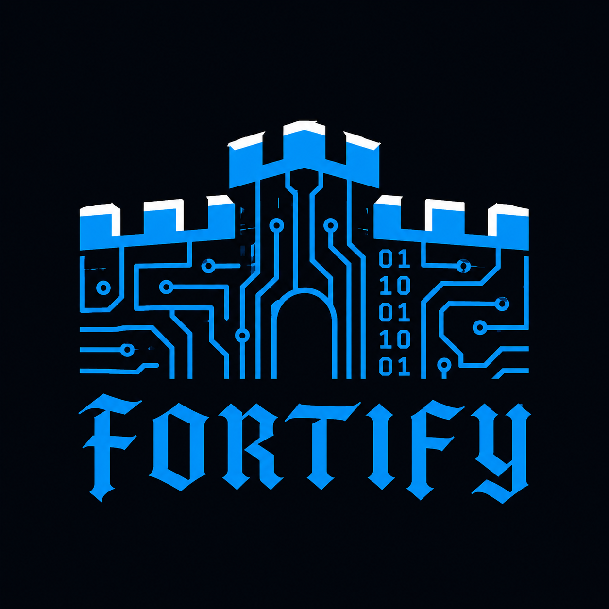

<p align="center">
  
</p>

<h1 align="center">Fortify</h1>

<p align="center">
  <b>Open-source web application security scanner powered by AI</b>
</p>

<p align="center">
  
  
  
  
</p>

---

## Overview

**Fortify** is an open-source web application security tool that helps developers and security professionals identify vulnerabilities and improve web app defenses. It consists of three main components:

| Component | Description |
|---|---|
| **Scanner** | Python-based module that tests web apps for common security issues (headers, injections, misconfigurations) |
| **AI Analyzer** | AI engine that reads scanner output, calculates risk levels, and gives actionable remediation suggestions |
| **Dashboard** | Frontend interface to visualize scan results, vulnerabilities, and risk assessments |

---

## Features

- Web app security scanning — HTTP headers, injection vectors, misconfigurations
- AI-powered risk scoring and vulnerability analysis
- Interactive dashboard to visualize findings
- FastAPI backend with Uvicorn for fast, async performance
- Modular and extensible architecture

---

## Project Structure

```
Fortify/
├── assets/                 # Static assets (logo, images)
├── fortify-backend/        # FastAPI backend & scanner logic
├── fortify-dashboard/      # Frontend dashboard (Node.js)
├── requirements.txt        # Python dependencies
├── LICENSE
└── README.md
```

---

## Getting Started

### Prerequisites

- Python 3.10+
- Node.js (for the dashboard)
- WSL2 (Windows users) or Linux/macOS

### Installation

```bash
# Clone the repository
git clone https://github.com/Givemeboga/Fortify.git
cd Fortify

# Create and activate a virtual environment
python3 -m venv fortify-venv
source fortify-venv/bin/activate  # Windows: fortify-venv\Scripts\activate

# Install Python dependencies
pip install -r requirements.txt
```

---

## Running

### Backend

Run the FastAPI backend from the project root:

```bash
uvicorn fortify-backend.main:app --reload --port 8500
```

The API will be available at `http://localhost:8500`.  
Interactive docs are at `http://localhost:8500/docs`.

### Dashboard

```bash
cd fortify-dashboard
npm install
npm run dev
```

---

## Contributing

Contributions are welcome! Here's how to get started:

1. Fork the repository
2. Create a branch: `git checkout -b feature/your-feature`
3. Commit your changes: `git commit -m "Add your feature"`
4. Push to your branch: `git push origin feature/your-feature`
5. Open a pull request

Please make sure your code is clean and tested before submitting.

---

## License

This project is licensed under the [MIT License](LICENSE) © 2026 Youssef Ben Chaouacha.