<p align="center">
  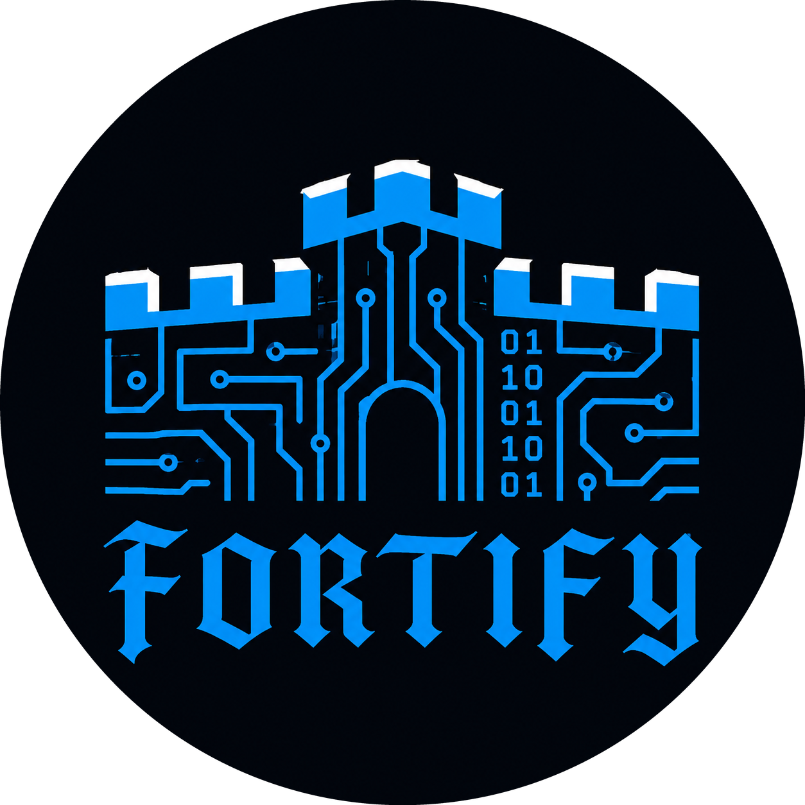
</p>

<h1 align="center">Fortify</h1>

<p align="center">
  <b>Open-source web application security scanner with AI-assisted analysis</b>
</p>

<p align="center">
  
  
  
  
  
</p>

<p align="center">
  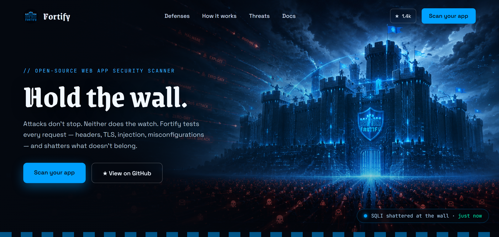
</p>

---

## Table of Contents

- [Overview](#overview)
- [Screenshots](#screenshots)
- [Quick Start](#quick-start)
- [Usage](#usage)
- [How It Works](#how-it-works)
- [Project Structure](#project-structure)
- [Roadmap](#roadmap)
- [Responsible Use](#responsible-use)
- [Contributing](#contributing)
- [License](#license)

---

## Overview

**Fortify** is an open-source web application security tool that helps developers and security professionals find vulnerabilities and harden web apps. Three components work together:

| Component | Description | Status |
|---|---|---|
| **Scanner** | Python module testing for common issues (headers, TLS, misconfigurations, injections) | 🟢 Passive + active |
| **AI Analyzer** | LLM that reads scanner output, scores risk, and gives remediation — **local by default (Ollama)** so data stays on your machine; pluggable | 🟢 Complete |
| **Dashboard** | React + Tailwind console to launch scans, watch the live Siege Log, read AI reports, and pick the provider | 🟢 Complete |

> ⚠️ **AI output is guidance, not ground truth.** Severity scoring is the LLM's judgment and can vary; the scanner's raw results are the authoritative facts. Treat the analysis as a triage starting point.

---

## Screenshots

The operator console, running live against the scanner and AI Analyzer.

**Command** — launch a scan and watch the live Siege Log.

<p align="center">
  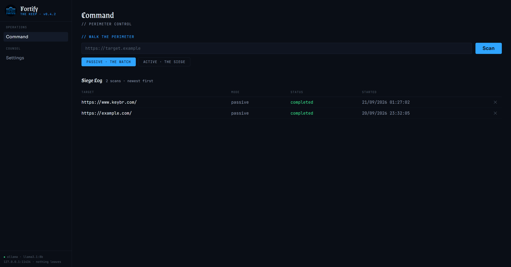
</p>

**Battle Report** — raw findings (TLS, headers, sensitive paths) beside a grounded **AI risk analysis** (risk badge, per-finding severity, prioritized fixes).

<p align="center">
  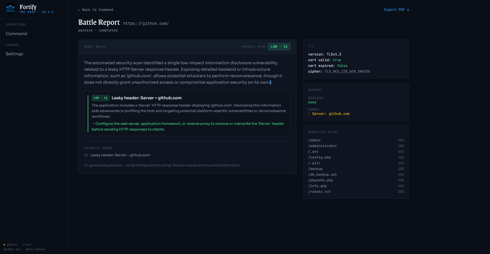
</p>

**Settings (BYOK)** — run analysis on a **local model (Ollama)** so nothing leaves your machine, or bring your own **Gemini** key for cloud analysis.

<p align="center">
  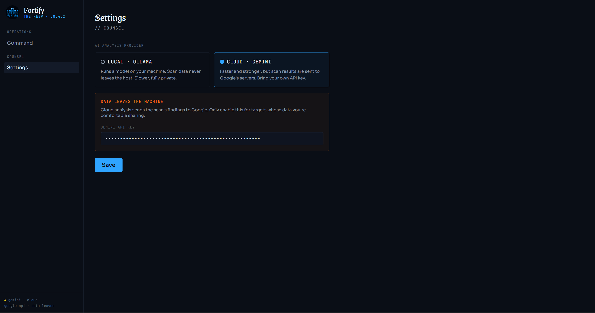
</p>

**Export PDF** — save any Battle Report as a clean, shareable document.

<p align="center">
  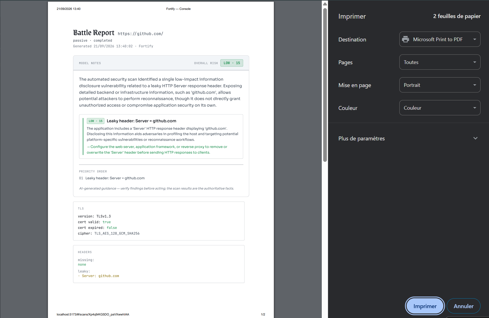
</p>

<details>
<summary><b>🏰 See the landing page (design mock)</b></summary>

<br />

The medieval-fortress metaphor carried through the whole experience.

<p align="center">
  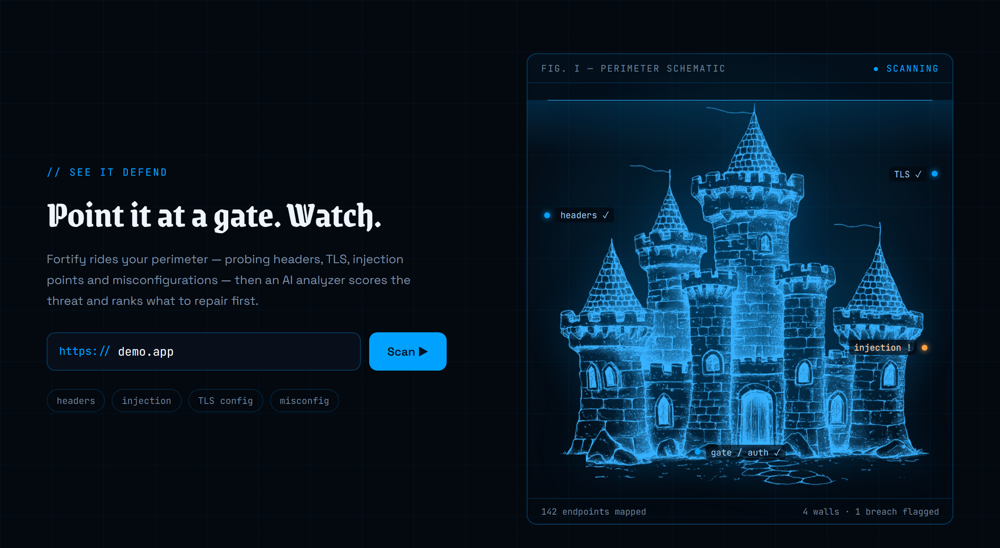
</p>
<p align="center"><i>See it defend — point Fortify at a URL and watch it probe the perimeter.</i></p>

<p align="center">
  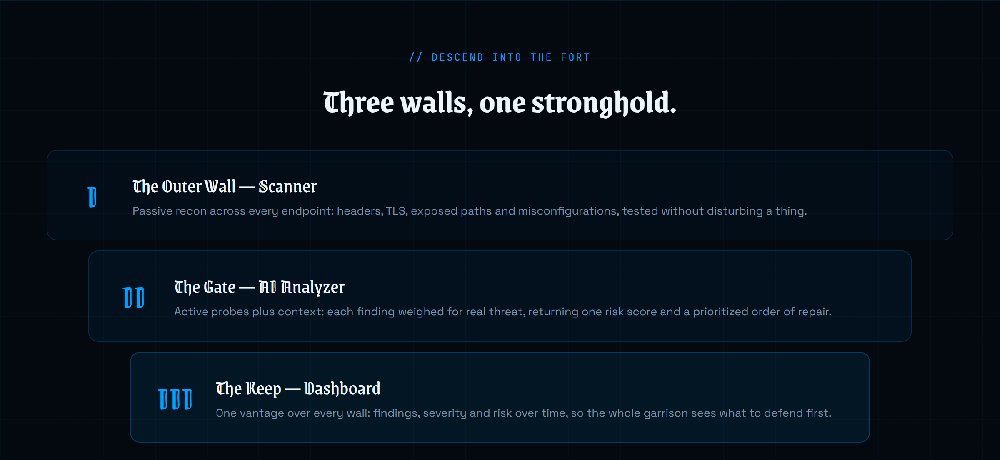
</p>
<p align="center"><i>Three walls, one stronghold — the Scanner, AI Analyzer, and Dashboard.</i></p>

<p align="center">
  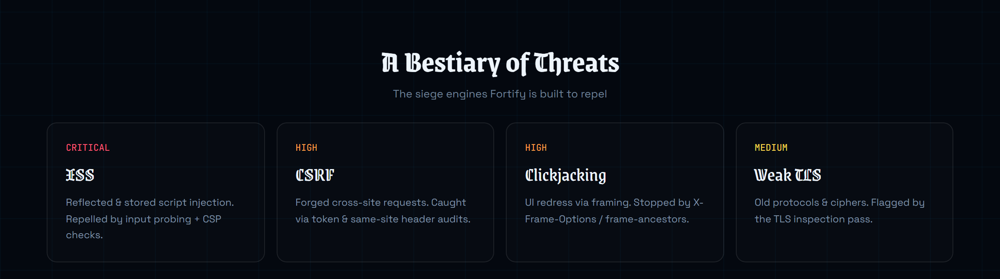
</p>
<p align="center"><i>A bestiary of threats — the classes of vulnerability Fortify is built to repel.</i></p>

<p align="center">
  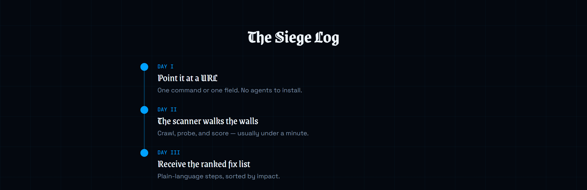
</p>
<p align="center"><i>The siege log — from a URL to a ranked, prioritized fix list.</i></p>

<p align="center">
  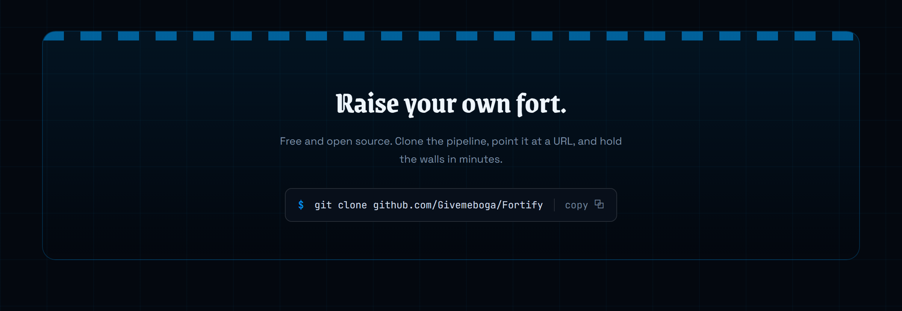
</p>
<p align="center"><i>Free and open source — clone the pipeline and hold the walls in minutes.</i></p>

> The landing page is a design mock; the wired-up dashboard is shown in the [Screenshots](#screenshots) above.

</details>

---

## Quick Start

### Run with Docker (recommended)

The whole stack — backend, dashboard, and a persistent database — runs with one command. You only need [Docker Desktop](https://www.docker.com/products/docker-desktop/) (engine running).

```bash
docker compose up --build
```

Then open:

| Service | URL |
|---|---|
| **Dashboard** | http://localhost:5173 |
| Backend API | http://localhost:8500 |

- **AI analysis with Ollama** — run Ollama on your **host** (`ollama pull llama3.1:8b`). The backend container reaches it automatically via `host.docker.internal`; no config needed.
- **AI analysis with Gemini** — no `.env` required: pick the provider and paste your key in the dashboard's **Settings** (BYOK, stored in your browser).
- **Data persistence** — scans live in a named volume (`fortify-data`). `docker compose down` keeps them; `docker compose down -v` wipes for a clean reset.

<details>
<summary><b>Run locally without Docker</b></summary>

<br />

**Prerequisites:** Python 3.10+, Node.js, and (optional, for AI analysis) [Ollama](https://ollama.com) with `ollama pull llama3.1:8b`.

**1. Backend**

```bash
git clone https://github.com/Givemeboga/Fortify.git
cd Fortify

python -m venv venv
source venv/bin/activate          # Windows: venv\Scripts\activate
pip install -r requirements.txt

cd fortify-backend
uvicorn main:app --port 8500
```

The API is at `http://localhost:8500`, with Swagger docs at `/docs`.

**2. Dashboard** (in a second terminal)

```bash
cd fortify-dashboard
npm install
npm run dev                        # http://localhost:5173
```

**3. Configuration (AI Analyzer)** — the LLM backend is chosen via env vars or the dashboard Settings. For a server-side default, copy the template:

```bash
cp fortify-backend/.env.example fortify-backend/.env
```

| Variable | Values | Meaning |
|---|---|---|
| `LLM_PROVIDER` | `ollama` (default) / `gemini` | Which LLM backend to use |
| `GEMINI_API_KEY` | your key | Required **only** for `gemini` (free key at [Google AI Studio](https://aistudio.google.com)) |

- **`ollama`** — local model; scan data never leaves your machine.
- **`gemini`** — sends results to Google's API; sharper output, but data leaves the machine. Opt-in, bring-your-own-key.

`.env` is gitignored — **never commit your API key.** The dashboard also sends a key per request (BYOK), falling back to `.env`.

</details>

---

## Usage

Prefer the [Quick Start](#quick-start) to run the full app. For scripting or API use:

<details>
<summary><b>As a Python library</b></summary>

<br />

From inside `fortify-backend/`:

```python
from scanner.passive.runner import run_passive_scan
import json

result = run_passive_scan("https://example.com")
print(json.dumps(result, indent=2))
```

Returns a nested dict with `tls`, `headers`, and `status` sections — ready to store, serve, or analyze.

</details>

<details>
<summary><b>Over the HTTP API</b></summary>

<br />

With the backend running (see Quick Start), scans run in the background — the request returns an ID immediately and you poll for the result:

```bash
# start a scan (returns an id immediately)
curl -X POST http://localhost:8500/scan \
  -H "Content-Type: application/json" \
  -d '{"url": "https://example.com"}'
# → {"id": "a7Kp9wQ...", "status": "pending"}

# retrieve the result by that id
curl http://localhost:8500/scans/a7Kp9wQ...
```

| Method | Endpoint | Description |
|---|---|---|
| `POST` | `/scan` | Start a background scan (`scan_type`: `passive` default, or `active`); returns the scan ID |
| `GET` | `/scans` | List all scans (newest first) |
| `GET` | `/scans/{id}` | Retrieve one scan (`404` if not found) |
| `POST` | `/scans/{id}/analyze` | Run the AI Analyzer on a completed scan (`404`/`409` as applicable) |
| `DELETE` | `/scans/{id}` | Delete a scan |

Scan IDs are unguessable strings (not sequential), and invalid URLs / unknown `scan_type` values are rejected with `422` at the API boundary.

</details>

---

## How It Works

<details>
<summary><b>Scanner, backend, AI Analyzer, and dashboard — the full breakdown</b></summary>

<br />

### Passive scanner (read-only, safe)

- **TLS** — protocol version, certificate expiry/validity, cipher suite
- **Headers** — missing defensive headers, present headers, leaky (version-disclosing) headers, redirect chain
- **Sensitive paths** — probes common exposed paths (`/.env`, `/.git/`, `/admin`, …). Exposure is judged by **content signals** (content-type + body fingerprints), not a bare `200`, so sites that return real pages for those paths don't false-positive; public-by-design paths (`robots.txt`) are excluded.

### Active scanner (injection-based, opt-in & consent-gated)

Injects payloads into each URL query parameter and reports the vulnerable parameter, the triggering payload, the matched signal, and scan-health counters (`requests_made`, `errors`) so a failed scan is never mistaken for a clean one:

- **SQL injection** — flags a parameter when a payload makes the response leak a database error signature.
- **Cross-site scripting (XSS)** — flags a parameter when a script payload is reflected **unescaped** (exact-match, so escaped reflections are cleared).
- **Path traversal** — flags a parameter when a `../` payload leaks system-file contents (e.g. `/etc/passwd`).

### FastAPI backend

Scans run as background tasks; results persist to **SQLite** with a full create → update → retrieve lifecycle (nested result stored as JSON). Scan IDs are **unguessable strings** to prevent enumeration/IDOR. AI analysis also runs in the background, with its status persisted so the dashboard can poll and survive refreshes.

### AI Analyzer (grounded)

Turns raw scan facts into an interpreted risk report: overall risk score/level, plain-language summary, per-finding severity + remediation, and a prioritized fix order. It runs on a **local LLM via [Ollama](https://ollama.com)** by default (data never leaves your machine); a **cloud option (Google Gemini)** is available opt-in, BYOK, from Settings.

To stay trustworthy, the analyzer is **grounded**: findings are extracted from the scan results **deterministically in code** first, and the LLM is asked only to *explain and score confirmed findings* — never to invent new ones. Risk **levels are computed from scores in code** (so they can't disagree), and every report carries a verify-before-acting disclaimer.

### Dashboard (React + Tailwind)

- **Command** — scan form with a passive/active toggle and an explicit **consent gate** for active scans, plus a live **Siege Log** (polls the API, colour-codes status, delete + pagination).
- **Battle Report** — raw findings beside an animated **AI analysis** panel; analysis runs non-blocking with a spinner, exports to **PDF**, and the view is URL-routed (refresh/back work).
- **Settings** — choose **Local · Ollama** vs **Cloud · Gemini** and supply your own key (BYOK); the footer shows the active provider and its privacy posture.

</details>

---

## Project Structure

<details>
<summary><b>Directory tree</b></summary>

<br />

```
Fortify/
├── assets/                      # Static assets (logo, images, screenshots)
├── docker-compose.yml           # One-command full stack
├── fortify-backend/             # FastAPI backend & scanner logic
│   ├── Dockerfile
│   ├── main.py                  # FastAPI entry point
│   ├── db.py                    # SQLite data layer (scan persistence)
│   ├── analyzer/                # AI risk analysis (separate from the scanner)
│   │   ├── analyzer.py          # Grounding, prompt building, deterministic levels
│   │   └── llm.py               # LLM backend — Ollama / Gemini (pluggable)
│   └── scanner/
│       ├── passive/             # Read-only checks (tls, headers, status, runner)
│       ├── active/              # Injection checks (sqli, xss, path_traversal, runner)
│       └── config/              # Wordlists, payloads, signatures
├── fortify-dashboard/           # React + Tailwind frontend (Vite)
│   ├── Dockerfile
│   └── src/
│       ├── App.jsx              # Layout, shared state, hash routing
│       └── components/          # Sidebar, ScanForm, SiegeLog, BattleReport, Settings
├── requirements.txt
├── LICENSE
└── README.md
```

</details>

---

## Roadmap

Fortify is built in phases. This table reflects the **actual** current state.

| Phase | Scope | Status |
|---|---|---|
| **1 — Scanner core** | Passive (TLS, headers, sensitive paths) + active (SQLi, XSS, path traversal) | ✅ Done |
| **2 — Backend + DB** | SQLite storage + FastAPI endpoints | ✅ Done |
| **3 — AI Analyzer** | Grounded LLM risk scoring & remediation (Ollama + Gemini) | ✅ Done |
| **4 — Dashboard** | Command, Battle Report, Settings (BYOK) | ✅ Done |
| **5 — Polish** | Docker, PDF export, hardening (unguessable IDs, non-blocking analysis, URL routing), demo | ✅ Done |

See the [open issues](https://github.com/Givemeboga/Fortify/issues) for what's next (deeper scanner coverage, notifications, scale).

---

## Responsible Use

Fortify is intended for **authorized security testing only**. Only scan systems you **own** or have **explicit written permission** to test. Unauthorized scanning may be illegal under computer-misuse laws (e.g. the CFAA in the US and equivalents elsewhere). You are solely responsible for how you use this tool.

---

## Contributing

Contributions are welcome!

> **Golden rule: never commit directly to `main`.** `main` is the released branch and must stay stable and deployable at all times. **Every** change — feature, fix, or docs — goes through its own branch and a pull request.

### Workflow

1. **Fork** the repo (external contributors) — collaborators can branch directly.
2. **Branch off `main`**, one branch per issue/feature, named by intent (`feat/…`, `fix/…`, `docs/…`):
   ```bash
   git checkout main && git pull
   git checkout -b feat/your-feature
   ```
3. **Commit** small, focused changes with clear messages.
4. **Push** and open a **pull request** into `main`. Reference the issue it closes (e.g. "Closes #9").
5. Keep `main` releasable — don't merge half-finished or failing work.

Please keep code clean and tested before submitting.

---

## License

Licensed under the [MIT License](LICENSE) © 2026 Youssef Ben Chaouacha.
