<p align="center">
  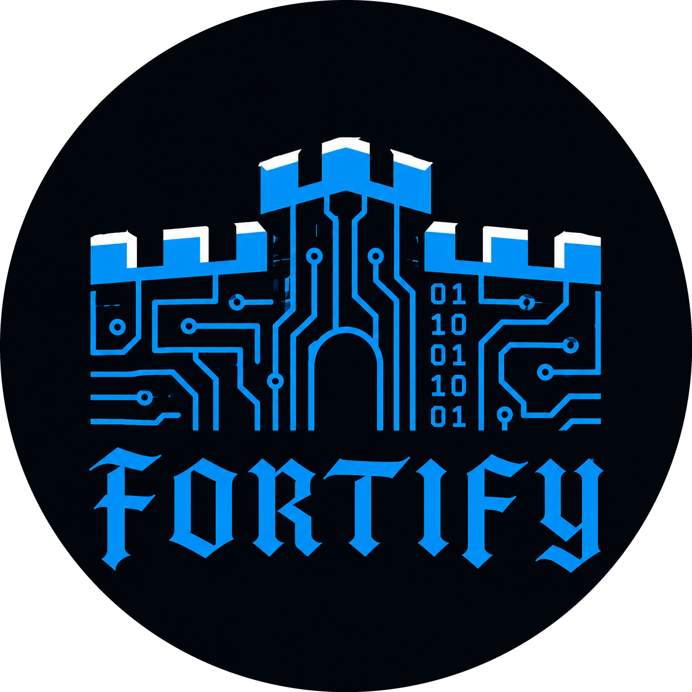
</p>

<h1 align="center">Fortify</h1>

<p align="center">
  <b>Open-source web application security scanner with AI-assisted analysis</b>
</p>

<p align="center">
  
  
  
  
  
</p>

<p align="center">
  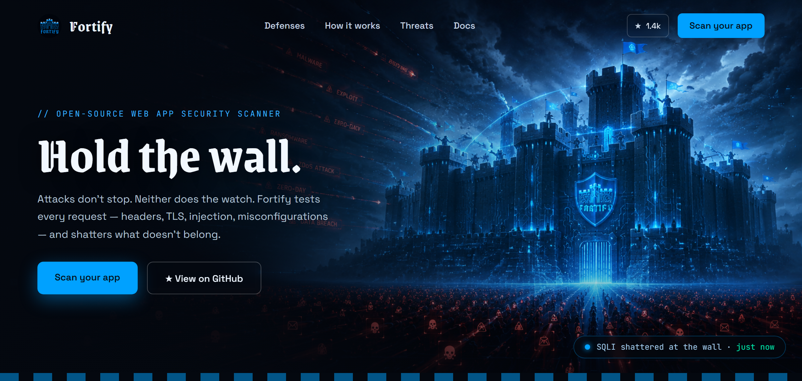
</p>

---

## Table of Contents

- [Overview](#overview)
- [Screenshots](#screenshots)
- [Quick Start](#quick-start)
- [Usage](#usage)
- [How It Works](#how-it-works)
- [Project Structure](#project-structure)
- [Roadmap](#roadmap)
- [Responsible Use](#responsible-use)
- [Contributing](#contributing)
- [License](#license)

---

## Overview

**Fortify** is an open-source web application security tool that helps developers and security professionals find vulnerabilities and harden web apps. Three components work together:

| Component | Description | Status |
|---|---|---|
| **Scanner** | Go module testing for common issues (headers, TLS, misconfigurations, injections, open ports) | 🟢 Passive + active |
| **AI Analyzer** | Explains scanner findings and gives remediation, with severity **scored deterministically in code** — **local by default (Ollama)** so data stays on your machine; pluggable | 🟢 Complete |
| **Dashboard** | React + Tailwind gothic "Keep" console — a Command overview (stained-glass stat façade, severity rollup, threat & AI-model breakdowns), the Siege Log, Battle Reports, and provider settings | 🟢 Complete |

> ⚠️ **AI output is guidance, not ground truth.** The scanner's raw results are the authoritative facts, and the AI's explanations are a triage starting point — verify before acting. (Severity **scores are computed deterministically in code**, not by the LLM, so they don't drift between runs.)

---

## Screenshots

The operator console, running live against the scanner and AI Analyzer.

> ℹ️ The shots below are from the v1.1 console. **v1.2.0 introduces the gothic "Keep" redesign** — a Command overview dashboard, the Scriptorium, and the Siege Log / Counsel split described under [How It Works](#how-it-works). Refreshed screenshots are on the way.

**Command** — launch a scan and watch the live Siege Log.

<p align="center">
  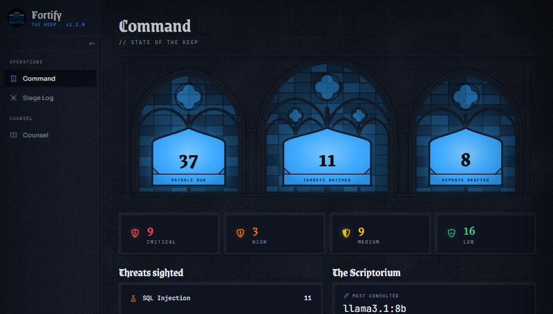
</p>

**Battle Report** — raw findings (TLS, headers, sensitive paths) beside a grounded **AI risk analysis** (risk badge, per-finding severity, prioritized fixes).

<p align="center">
  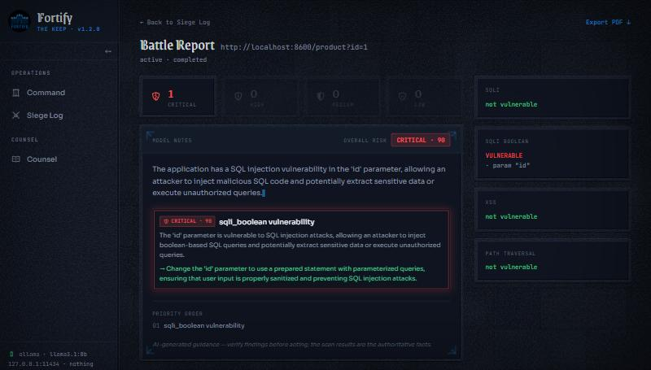
</p>

**Settings (BYOK)** — run analysis on a **local model (Ollama)** so nothing leaves your machine, or bring your own **Gemini** key for cloud analysis.

<p align="center">
  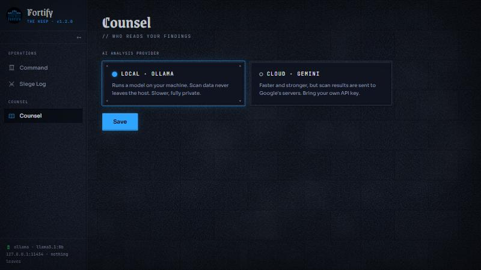
</p>

**Export PDF** — save any Battle Report as a clean, shareable document.

<p align="center">
  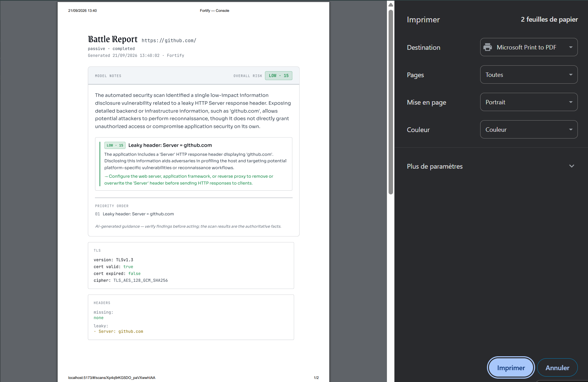
</p>

<details>
<summary><b>🏰 See the landing page (design mock)</b></summary>

<br />

The medieval-fortress metaphor carried through the whole experience.

<p align="center">
  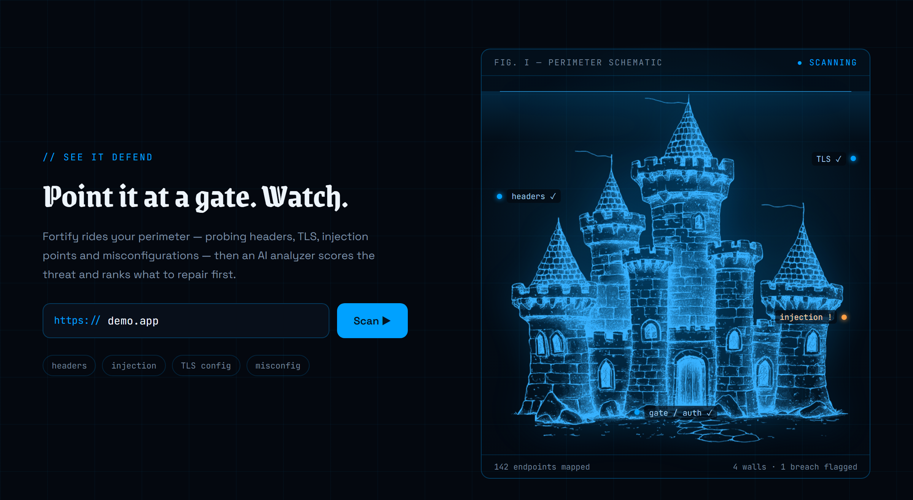
</p>
<p align="center"><i>See it defend — point Fortify at a URL and watch it probe the perimeter.</i></p>

<p align="center">
  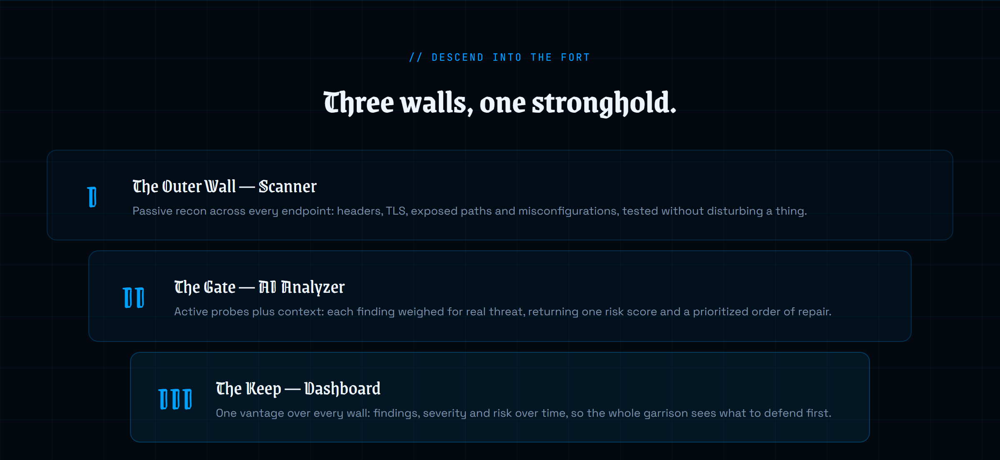
</p>
<p align="center"><i>Three walls, one stronghold — the Scanner, AI Analyzer, and Dashboard.</i></p>

<p align="center">
  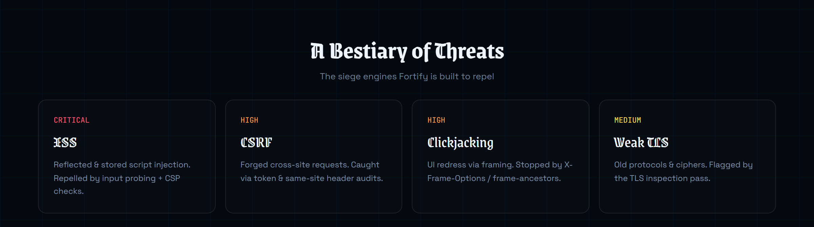
</p>
<p align="center"><i>A bestiary of threats — the classes of vulnerability Fortify is built to repel.</i></p>

<p align="center">
  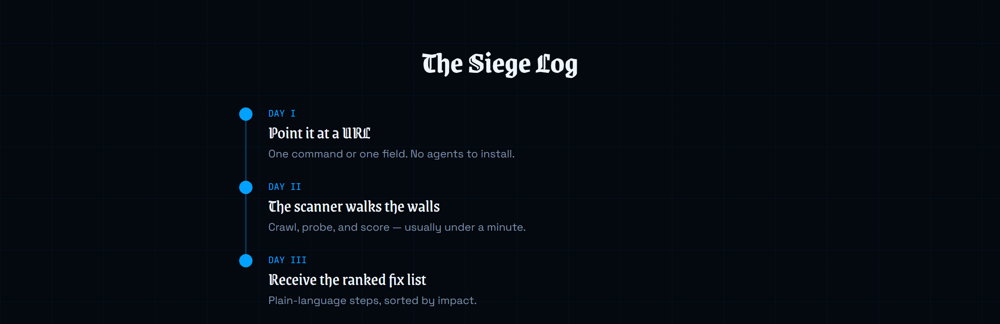
</p>
<p align="center"><i>The siege log — from a URL to a ranked, prioritized fix list.</i></p>

<p align="center">
  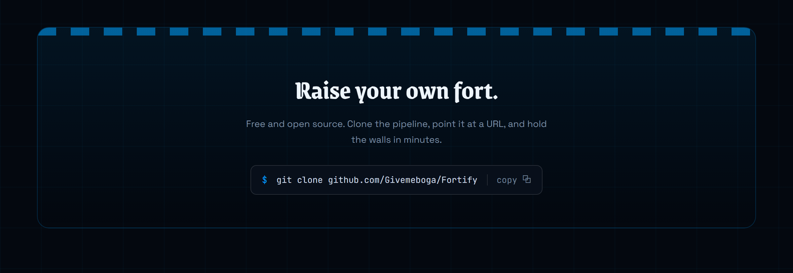
</p>
<p align="center"><i>Free and open source — clone the pipeline and hold the walls in minutes.</i></p>

> The landing page is a design mock; the wired-up dashboard is shown in the [Screenshots](#screenshots) above.

</details>

---

## Quick Start

### Run with Docker (recommended)

The whole stack — backend, dashboard, and a persistent database — runs with one command. You only need [Docker Desktop](https://www.docker.com/products/docker-desktop/) (engine running).

```bash
docker compose up --build
```

Then open:

| Service | URL |
|---|---|
| **Dashboard** | http://localhost:5173 |
| Backend API | http://localhost:8500 |

- **AI analysis with Ollama** — run Ollama on your **host** (`ollama pull llama3.1:8b`). The backend container reaches it automatically via `host.docker.internal`; no config needed.
- **AI analysis with Gemini** — no `.env` required: pick the provider and paste your key in the dashboard's **Settings** (BYOK, stored in your browser).
- **Data persistence** — scans live in a named volume (`fortify-data`). `docker compose down` keeps them; `docker compose down -v` wipes for a clean reset.

### Deploying to the cloud

The dashboard is a static bundle that calls the backend from the **browser**, so it must be built with the backend's public URL:

```bash
cp .env.example .env    # then set VITE_API_URL=https://your-backend-host:8500
docker compose up --build -d
```

Run one compose stack per host (backend `:8500`, dashboard `:5173` mapped to host port 80/443 behind your reverse proxy), or deploy the two images separately — any host that serves the dashboard bundle and any host that runs `./fortify-go` will pair as long as `VITE_API_URL` points at the backend. Cloud LLM providers (Gemini/OpenAI/Anthropic/custom) need no Ollama; paste the key in Counsel (BYOK) or set it in the backend environment.

<details>
<summary><b>Run locally without Docker</b></summary>

<br />

**Prerequisites:** Go 1.24+, Node.js, and (optional, for AI analysis) [Ollama](https://ollama.com) with `ollama pull llama3.1:8b`.

**1. Backend**

```bash
git clone https://github.com/Givemeboga/Fortify.git
cd Fortify/fortify-backend-go

go run ./cmd/server              # API at http://localhost:8500
```

**2. Dashboard** (in a second terminal)

```bash
cd fortify-dashboard
npm install
npm run dev                        # http://localhost:5173
```

**3. Configuration (AI Analyzer)** — the LLM backend is chosen via env vars or the dashboard Counsel page. For a server-side default, copy the template:

```bash
cp fortify-backend-go/.env.example fortify-backend-go/.env
```

| Variable | Values | Meaning |
|---|---|---|
| `LLM_PROVIDER` | `ollama` (default) / `gemini` / `openai` / `anthropic` / `custom` | Which LLM backend to use |
| `GEMINI_API_KEY` / `OPENAI_API_KEY` / `ANTHROPIC_API_KEY` | your key | Required **only** for the matching cloud provider (dashboard BYOK also works per request) |
| `CUSTOM_LLM_BASE_URL` + `CUSTOM_LLM_MODEL` | url + model | Required **only** for `custom` (any OpenAI-compatible endpoint) |

- **`ollama`** — local model; scan data never leaves your machine.
- **cloud providers** — send results to the provider's API; sharper output, but data leaves the machine. Opt-in, bring-your-own-key.

`.env` is gitignored — **never commit your API key.** The dashboard also sends a key per request (BYOK), falling back to `.env`.

</details>

---

## Usage

Prefer the [Quick Start](#quick-start) to run the full app. For scripting or API use:

<details>
<summary><b>Over the HTTP API</b></summary>

<br />

With the backend running (see Quick Start), scans run in the background — the request returns an ID immediately and you poll for the result:

```bash
# start a scan (returns an id immediately)
curl -X POST http://localhost:8500/scan \
  -H "Content-Type: application/json" \
  -d '{"url": "https://example.com"}'
# → {"id": "a7Kp9wQ...", "status": "pending"}

# retrieve the result by that id
curl http://localhost:8500/scans/a7Kp9wQ...
```

| Method | Endpoint | Description |
|---|---|---|
| `POST` | `/scan` | Start a background scan (`scan_type`: `passive` default, or `active`; `ports`: `none` default, `top100`, `top1000`, or `full` for a concurrent TCP port scan); returns the scan ID |
| `GET` | `/scans` | List all scans (newest first) |
| `GET` | `/scans/{id}` | Retrieve one scan (`404` if not found) |
| `GET` | `/scans/{id}/diff` | Finding-level diff vs the previous scan of the same target (`?against=` overrides); added/removed signatures |
| `POST` | `/scans/{id}/analyze` | Run the AI Analyzer on a completed scan (`404`/`409` as applicable) |
| `DELETE` | `/scans/{id}` | Delete a scan |
| `POST` | `/schedules` | Start a Watchtower recurring scan (`interval_minutes` ≥ 5, optional `auto_analyze` + provider) |
| `GET` | `/schedules` | List all watches |
| `GET` | `/schedules/{id}` | Retrieve one watch |
| `PATCH` | `/schedules/{id}` | Pause/resume (`enabled`) or re-anchor the interval (`interval_minutes`) |
| `DELETE` | `/schedules/{id}` | Delete a watch |

Scan IDs are unguessable strings (not sequential), and invalid URLs / unknown `scan_type` values are rejected with `422` at the API boundary.

</details>

---

## How It Works

<details>
<summary><b>Scanner, backend, AI Analyzer, and dashboard — the full breakdown</b></summary>

<br />

### Passive scanner (read-only, safe)

- **TLS** — protocol version, certificate expiry/validity, cipher suite
- **Headers** — missing defensive headers, present headers, leaky headers (with **software + version extracted** when disclosed, e.g. `Server: nginx/1.18.0` → `nginx 1.18.0`), redirect chain
- **Sensitive paths** — probes common exposed paths (`/.env`, `/.git/`, `/admin`, …). Exposure is judged by **content signals** (content-type + body fingerprints), not a bare `200`, so sites that return real pages for those paths don't false-positive; public-by-design paths (`robots.txt`) are excluded.
- **Port scan** (Go backend, opt-in per scan via the `ports` parameter: `top100` / `top1000` / `full`) — resolves the target hostname to IPs and probes TCP ports concurrently with service-name guessing and banner grabs; risky exposures (SMB, RDP, databases, …) score high in analysis.
- **Cookies** — every `Set-Cookie` checked for `Secure`, `HttpOnly`, and an explicit `SameSite` policy.
- **CORS** — replays the request with an attacker `Origin`; flags a reflected origin (or `*`) combined with credential sharing.
- **HTTP methods** — reads `Allow` (plus a direct `TRACE` probe) and flags risky verbs (`TRACE`, `PUT`, `DELETE`, …).
- **security.txt** — checks `/.well-known/security.txt` for a valid contact channel (RFC 9116).
- **Client-side secrets** — scans page HTML plus same-origin scripts for concrete token formats (AWS keys, Google API keys, Slack tokens, private keys, …); placeholders are filtered and previews redacted.

### Active scanner (injection-based, opt-in & consent-gated)

Injects payloads into each URL query parameter and reports the vulnerable parameter, the triggering payload, the matched signal, and scan-health counters (`requests_made`, `errors`) so a failed scan is never mistaken for a clean one:

- **SQL injection** — **error-based** (a payload makes the response leak a database error signature) *and* **boolean-based blind** (compares a TRUE vs FALSE condition and flags a parameter when the two responses differ meaningfully — catching injections that leak no error).
- **Cross-site scripting (XSS)** — injects a **unique per-scan token** and flags a parameter when it's reflected **unescaped** (exact-match, so escaped reflections are cleared and pre-existing page content can't trigger a false positive).
- **Path traversal** — flags a parameter when a `../` payload leaks system-file contents (e.g. `/etc/passwd`).

### Go backend

Scans run in background goroutines; results persist to **SQLite** with a full create → update → retrieve lifecycle (nested result stored as JSON). Scan IDs are **unguessable strings** to prevent enumeration/IDOR. AI analysis also runs in the background, with its status persisted so the dashboard can poll and survive refreshes. A `/healthz` endpoint backs the Docker healthcheck.

### Watchtower (recurring scans + change detection, Go backend)

A scheduler inside the backend fires **watches** (target + scan profile + interval, minimum 5 minutes, optional auto-analysis with the Counsel provider) and stamps each run — missed runs while the server was down fire on the next tick. Every Battle Report diffs its scan against the previous scan of the same target (`GET /scans/{id}/diff`), so new exposures — an opened port, a leaked secret, a dropped header — surface as added/removed finding signatures.

### AI Analyzer (grounded)

Turns raw scan facts into an interpreted risk report: overall risk score/level, plain-language summary, per-finding severity + remediation, and a prioritized fix order. It runs on a **local LLM via [Ollama](https://ollama.com)** by default (data never leaves your machine); a **cloud option (Google Gemini)** is available opt-in, BYOK, from Counsel. Each report records which **provider and model** produced it, which the Command dashboard's Scriptorium aggregates.

To stay trustworthy, the analyzer is **grounded** and the numbers are **deterministic**: findings are extracted from the scan results **in code** first, and each is assigned a severity **score and level by a fixed rule table in code** (with context bumps — e.g. a version-disclosing header scores higher than a bare one; an exposed `.env` higher than a generic path). The LLM is asked only to *explain, remediate, and summarize* the confirmed findings — **never to score or invent** them. It runs at **temperature 0**, so the same scan yields the same report every time. Every report carries a verify-before-acting disclaimer.

### Dashboard (React + Tailwind) — the "Keep" theme

A medieval/gothic operator console — carved-stone panels, hand-inked icons, a layered stone backdrop, and a collapsible sidebar:

- **Command** — an at-a-glance overview: a stained-glass **stat façade** (patrols run / targets watched / reports drafted), a **severity rollup**, a **Threats sighted** breakdown by vulnerability class, and **The Scriptorium** — a 7-day **candle chart** of AI reports that splits by provider (Ollama burns blue, Gemini orange, side by side on days with both) alongside the most-used model and its share.
- **Siege Log** — the scan form (passive/active toggle + an explicit **consent gate** for active scans) above the full scan table (status, severity chips, delete, pagination).
- **Battle Report** — raw findings beside an animated **AI analysis** panel; analysis runs non-blocking, exports to **PDF**, and the view is URL-routed (refresh/back work). Each report also shows **what changed since the previous scan** of the same target.
- **Watchtower** — recurring scans on an interval (hourly → weekly, optional auto-analysis); the scheduler fires them in the background and diffs every run.
- **Counsel** — choose **Local · Ollama** vs cloud (**Gemini**, **OpenAI**, **Anthropic**) or a **custom OpenAI-compatible endpoint**, and supply your own key (BYOK); the sidebar footer shows the active provider and its privacy posture.

</details>

---

## Project Structure

<details>
<summary><b>Directory tree</b></summary>

<br />

```
Fortify/
├── assets/                      # Static assets (logo, images, screenshots)
├── docker-compose.yml           # One-command full stack
├── fortify-backend-go/          # Go backend (served by docker-compose)
│   ├── cmd/server/main.go       # Entry point (+ Watchtower scheduler)
│   ├── internal/api/            # Routes: scans, analysis, schedules, diff
│   ├── internal/db/             # SQLite layer (scans + schedules)
│   ├── internal/diff/           # Finding-signature change detection
│   ├── internal/analyzer/       # AI risk analysis (Ollama/Gemini/OpenAI/Anthropic/custom)
│   └── internal/scanner/
│       ├── passive/             # tls, headers, status, cookies, cors, methods,
│       │                        #   security_txt, secrets (+ runner)
│       ├── active/              # Injection checks (sqli, xss, path_traversal, runner)
│       └── ports/               # Host resolution + TCP profiles (top100/1000/full)
├── fortify-dashboard/           # React + Tailwind frontend (Vite)
│   ├── Dockerfile
│   └── src/
│       ├── App.jsx              # Layout, shared state, hash routing
│       ├── index.css            # Tailwind theme tokens + carved-stone material
│       └── components/          # Sidebar, Overview (Command), StainedGlassFacade,
│                                #   ScanForm, SiegeLog, BattleReport, Schedules (Watch),
│                                #   Settings (Counsel), icons/
├── .env.example                 # Compose overrides (VITE_API_URL for cloud deploys)
├── LICENSE
└── README.md
```

</details>

---

## Roadmap

Fortify is built in phases. This table reflects the **actual** current state.

| Phase | Scope | Status |
|---|---|---|
| **1 — Scanner core** | Passive (TLS, headers, sensitive paths) + active (SQLi, XSS, path traversal) | ✅ Done |
| **2 — Backend + DB** | SQLite storage + HTTP endpoints | ✅ Done |
| **3 — AI Analyzer** | Grounded LLM risk scoring & remediation (Ollama, Gemini, OpenAI, Anthropic, custom) | ✅ Done |
| **4 — Dashboard** | Command, Battle Report, Settings (BYOK) | ✅ Done |
| **5 — Polish** | Docker, PDF export, hardening (unguessable IDs, non-blocking analysis, URL routing), demo | ✅ Done |
| **6 — Keep UI** (v1.2.0) | Gothic console: Command overview dashboard, stained-glass façade, Scriptorium (per-provider AI-report chart), Siege Log / Counsel split, collapsible sidebar | ✅ Done |
| **7 — Go port + Watchtower** | Go backend (concurrent scans, port profiles, multi-provider analysis), Watchtower recurring scans with change detection, deeper passive checks (cookies, CORS, methods, security.txt, secrets) | ✅ Done |

See the [open issues](https://github.com/Givemeboga/Fortify/issues) for what's next (deeper scanner coverage, auto-analyze, notifications, scale).

---

## Responsible Use

Fortify is intended for **authorized security testing only**. Only scan systems you **own** or have **explicit written permission** to test. Unauthorized scanning may be illegal under computer-misuse laws (e.g. the CFAA in the US and equivalents elsewhere). You are solely responsible for how you use this tool.

---

## Contributing

Contributions are welcome! See **[CONTRIBUTING.md](CONTRIBUTING.md)** for the full guide.

**In short:** never commit directly to `main` — every change goes through its own branch (`feat/…`, `fix/…`, `docs/…`) and a pull request.

---

## License

Licensed under the [MIT License](LICENSE) © 2026 Youssef Ben Chaouacha.
